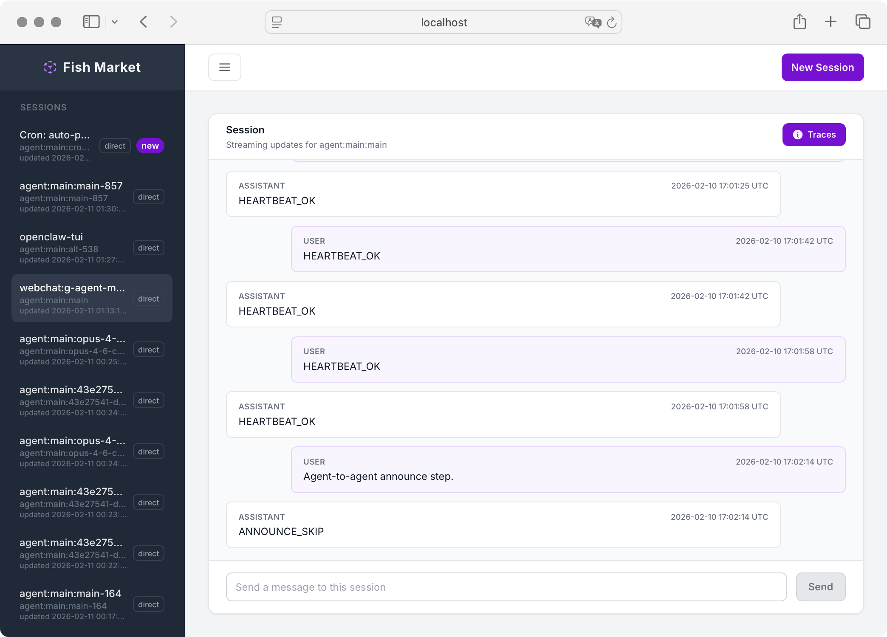

# Fish Market

This is a WIP Elixir/Phoenix application acting as a front-end to OpenClaw.



## Configuration

The application should be run with the following envars:

- `OPENCLAW_GATEWAY_URL`
- `OPENCLAW_GATEWAY_TOKEN` or `OPENCLAW_GATEWAY_PASSWORD`

OpenClaw now requires device pairing in many setups. On first connect, Fish Market may be placed on the pairing screen at `/gateway/pairing` if the device is not yet approved.

- Approve the pairing request in OpenClaw Control UI, then return to Fish Market.
- Alternatively, use `openclaw tui` and ask your agent to approve pending pairing requests.

The application should be hosted behind Cloudflare Zero Trust, as there is no authentication support currently.

## Production Release

### Building

```bash
MIX_ENV=prod mix assets.deploy
MIX_ENV=prod mix release fish_market --overwrite
```

### Environment Variables

| Variable | Required | Default | Description |
|---|---|---|---|
| `SECRET_KEY_BASE` | **Yes** | — | Generate with `mix phx.gen.secret` |
| `OPENCLAW_GATEWAY_URL` | **Yes** | — | WebSocket URL, e.g. `ws://127.0.0.1:18789` |
| `OPENCLAW_GATEWAY_TOKEN` | One of token/password | — | Gateway auth token |
| `OPENCLAW_GATEWAY_PASSWORD` | One of token/password | — | Gateway auth password |
| `PORT` | No | `4000` | HTTP listen port |
| `HOST` | No | `localhost` | Public hostname for URL generation |
| `URL_PORT` | No | Same as `PORT` | Public-facing port (e.g. `443` behind reverse proxy) |
| `URL_SCHEME` | No | Auto (`https` if URL_PORT=443) | URL scheme (`http` or `https`) |
| `DNS_CLUSTER_QUERY` | No | — | DNS cluster discovery query |

### Running

```bash
_build/prod/rel/fish_market/bin/fish_market start   # foreground
_build/prod/rel/fish_market/bin/fish_market daemon   # background
_build/prod/rel/fish_market/bin/fish_market stop     # stop
_build/prod/rel/fish_market/bin/fish_market remote   # IEx remote shell
```

### systemd and Cloudflare Tunnel Deployment

See [docs/DEPLOYMENT.md](docs/DEPLOYMENT.md) for the full guide — systemd unit file, Cloudflare Tunnel config, updating, and troubleshooting.

## TODO

- More Session Management stuff
- Refinement

## OpenClaw Upstream Bugs / Follow-ups

These are issues identified while building Fish Market that appear to be on the OpenClaw side.

- Thinking/reasoning stream is produced in embedded subscribe code, but not wired through gateway `chat.send`.
  - OpenClaw references:
    - `src/agents/pi-embedded-subscribe.handlers.messages.ts` (`emitReasoningStream(...)`)
    - `src/agents/pi-embedded-subscribe.ts` (`onReasoningStream` callback usage)
    - `src/gateway/server-methods/chat.ts` (`dispatchInboundMessage(...)` call in `chat.send` should wire `onReasoningStream`)
- Gateway chat projection currently emits text-only `chat` deltas/finals. Reasoning stream does not reach webchat clients through the chat channel.
  - OpenClaw reference:
    - `src/gateway/server-chat.ts` (`emitChatDelta` / `emitChatFinal`)
- OpenClaw web UI chat controller handles `chat` events for streaming text, but does not consume reasoning stream events as first-class chat traces.
  - OpenClaw reference:
    - `ui/src/ui/controllers/chat.ts`
- The control UI speaker label is not sourced from per-message sender metadata; it is injected via a bootstrap global `window.__OPENCLAW_ASSISTANT_NAME__` and then resolved from backend config.
  - OpenClaw references:
    - `src/gateway/control-ui.ts` (`injectControlUiConfig`, `window.__OPENCLAW_ASSISTANT_NAME__`)
    - `src/gateway/assistant-identity.ts` (`resolveAssistantIdentity` precedence)
    - `src/gateway/server-methods/agent.ts` (`agent.identity.get`)
    - `ui/src/ui/assistant-identity.ts`
